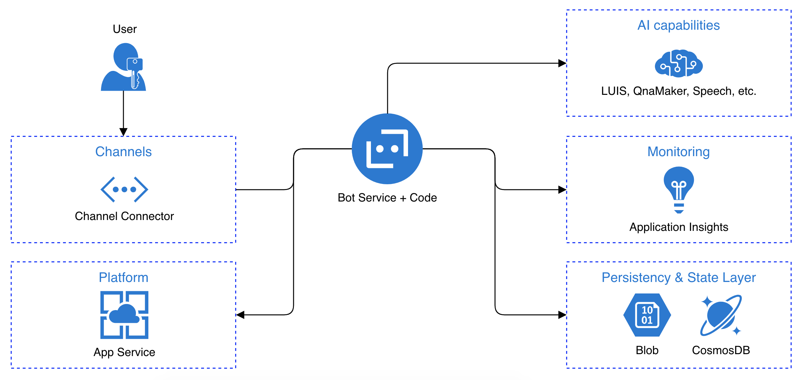

## Bot 

- [Bot](#bot)
- [Prerequisites](#prerequisites)
  - [Dotnet](#dotnet)
    - [To try this sample](#to-try-this-sample)
  - [python](#python)
- [Running the sample](#running-the-sample)
- [Testing the bot using Bot Framework Emulator](#testing-the-bot-using-bot-framework-emulator)
  - [Connect to the bot using Bot Framework Emulator](#connect-to-the-bot-using-bot-framework-emulator)
- [Deploy the bot to Azure](#deploy-the-bot-to-azure)
- [Tools](#tools)
- [Working with Bot](#working-with-bot)
  - [Theory](#theory)
  - [Write the code](#write-the-code)
  - [Create Azure components](#create-azure-components)

This bot has been created using [Bot Framework](https://dev.botframework.com), it shows the minimum code required to build a bot.

## Prerequisites

### Dotnet 
- [.NET Core SDK](https://dotnet.microsoft.com/download) version 5.0

  ```bash
  # determine dotnet version
  dotnet --version
  ```
- Bot Framework template 
  
  ```bash
    dotnet new -i Microsoft.Bot.Framework.CSharp.EchoBot
    dotnet new -i Microsoft.Bot.Framework.CSharp.CoreBot
    dotnet new -i Microsoft.Bot.Framework.CSharp.EmptyBot
  ```
#### To try this sample

- In a terminal, navigate to `AwesomeBot`

    ```bash
    # change into project folder
  cd AwesomeBot
    ```
- Update the config file 
  - Open `appsettings.json`
  - update `MicrosoftAppId` value from Azure Bot Services
  - update `MicrosoftAppPassword` value from key vault created with Azure Bot Services
  
- Run the bot from a terminal or from Visual Studio, choose option A or B.

  A) From a terminal

  ```bash
  # run the bot
  dotnet run
  ```

  B) Or from Visual Studio

  - Launch Visual Studio
  - File -> Open -> Project/Solution
  - Navigate to `AwesomeBot` folder
  - Select `AwesomeBot.csproj` file
  - Press `F5` to run the project

### python

- Install Python 3.6
- Install cookiecutter
- Download echo bot template 
  
    ```bash
    cookiecutter https://github.com/microsoft/BotBuilder-Samples/releases/download/Templates/echo.zip
    ```

More template available [here in Github](https://github.com/microsoft/BotBuilder-Samples/releases/tag/Templates) 

## Running the sample
- Run `pip install -r requirements.txt` to install all dependencies
- Run `python app.py`

## Testing the bot using Bot Framework Emulator
[Bot Framework Emulator](https://github.com/microsoft/botframework-emulator) is a desktop application that allows bot developers to test and debug their bots on localhost or running remotely through a tunnel.

- Install the Bot Framework Emulator version 4.9.0 or greater from [here](https://github.com/Microsoft/BotFramework-Emulator/releases)

### Connect to the bot using Bot Framework Emulator

- Launch Bot Framework Emulator
- File -> Open Bot
- Enter a Bot URL of `http://localhost:3978/api/messages`
- Enter Microsoft App Id 
- Enter Microsoft App Passwrod 

## Deploy the bot to Azure
To learn more about deploying a bot to Azure, see [Deploy your bot to Azure](https://aka.ms/azuredeployment) for a complete list of deployment instructions.

## Tools
- [Azure Bot Composer - the low code tool to create simple bot ](https://docs.microsoft.com/en-us/composer/introduction?tabs=v2x)
- [Adaptive cards - the no code UI componets usable by the bot framework](https://adaptivecards.io)
- [Bot Framework Samples](https://github.com/Microsoft/BotBuilder-Samples/blob/main/README.md)
- [Bot Framework Web Chat](https://github.com/microsoft/BotFramework-WebChat)

## Working with Bot

### Theory 

The azure bot uses rest API to communicate between the client (webchat or other channels) and Server (bot) pass through the Azure bot service



---
1. Channels - It's a translation layer between the azure bot framework and the bot's embedded place (like facebook, Twitter, mail, SMS). Each place uses different standards and API, so Microsoft created channels to handle this issue and use one common internal standard.
1. Every call from the channel goes pass through to the Azure Bot Service (it counts all calls) and forward it to our endpoint called **adapter**
1. Adapter - it's web service with one post endpoint (usualy `api/messages`) Adapter unwraps messages and invoke proper action  with the context  called **Turn** and **TurnContext**
1.  The TurnContext contains information about the current conversation, the activity that triggered the turn, the user state and further data points. 
The Turn is the single interaction between user and bot. Each User **Activity** generates a new Turn.
1. Activities are the events that our bot receives from its users. Probably the two most prominent activities are conversationUpdate and message. A full list of all supported Activities can be found [here](https://docs.microsoft.com/en-us/azure/bot-service/bot-service-activities-entities?view=azure-bot-service-4.0&tabs=js#activity-types)

### Write the code

he logic with our bot is in class `Bot.cs` or `Bot.py`
Dotnet code uses dedicated libaries called AdaptiveCards and AdaptiveCards.Template to simplify writing the code. More details you can find [here](https://docs.microsoft.com/en-us/adaptive-cards/templating/language)

```c#
public class Bot : ActivityHandler
{
    private readonly IAdaptiveCardsTemplates _templates;

    public Bot(IAdaptiveCardsTemplates templates)
    {
        _templates = templates;
    }
    protected override Task OnMessageActivityAsync(ITurnContext<IMessageActivity> turnContext, CancellationToken cancellationToken)
    {
        return turnContext.SendActivityAsync(
            _templates.EchoCard(turnContext.Activity.Text), cancellationToken: cancellationToken);
    }
}
```

```c#
public class AdaptiveCardsTemplates : IAdaptiveCardsTemplates
{
    public string EchoCard(string text)
    {
        var templateJson = @"
        {
            ""type"": ""AdaptiveCard"",
            ""version"": ""1.4"",
            ""body"": [
                {
                    ""type"": ""TextBlock"",
                    ""text"": ""echo ${text}!""
                }
            ]
        }";
        
        AdaptiveCardTemplate template = new AdaptiveCardTemplate(templateJson);
        var data = new
        {
            Text = text
        };
        
        return  template.Expand(data);
    }
}
```

### Create Azure components

Everything is well described in microsoft documentation - [link here](https://docs.microsoft.com/en-us/azure/bot-service/abs-quickstart?view=azure-bot-service-4.0&tabs=csharp)